# Level06 Writeup

## Level Overview

**Category :** Web Application Security / Code Injection

**Description :** 

Exploit a PHP application vulnerable to code injection through insecure use of the `preg_replace()` function with the deprecated `/e` modifier to escalate privileges and retrieve the flag.

## Analysis

When entring the level we found a `32-bit executable` `leve06` with a setuid bit set as `flag06` which means we need to exploit this binary to execute the `getflag` command

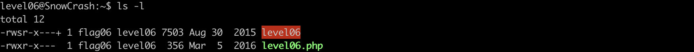
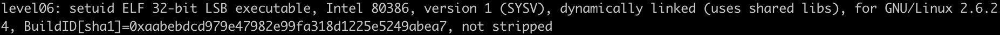

accompagning this binary there is also a php script `level06.php` that should be explaining what the binary does

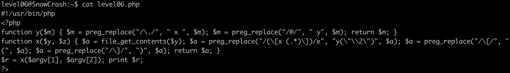

that's a messy code let's format it using [PHP Beautifier](https://codebeautify.org/php-beautifier) so we can understand it better .

```php
#!/usr/bin/php
<?php
function y($m)
{
    $m = preg_replace("/\./", " x ", $m); // replace "." with " x "
    $m = preg_replace("/@/", " y", $m); // replace "@" with "y"
    return $m;
}
function x($y, $z)
{
    $a = file_get_contents($y); // get the file contents and store it in $a
    $a = preg_replace("/(\[x (.*)\])/e", "y(\"\\2\")", $a); // replace [x some_text] with some_text and evaluates y("some_text") as PHP code
    $a = preg_replace("/\[/", "(", $a); // replace "[" with "("
    $a = preg_replace("/\]/", ")", $a); // replace "]" with ")"
    return $a;
}
$r = x($argv[1], $argv[2]);
print $r;

?>

```


We are going to focus only on line 12 that contains `preg_replace($pattern, $replacement, $subject)` which is a function in PHP that performs a regular expression search and replace , its searches `subject` for matches to `pattern` and replaces them with `replacement`.

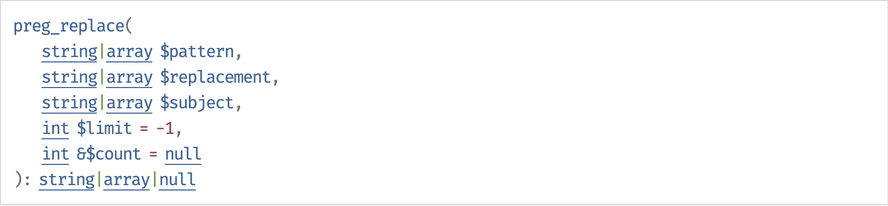

here is a little break of pattern `/(\[x (.*)]\)/e` from [RegExr](https://regexr.com/) : 
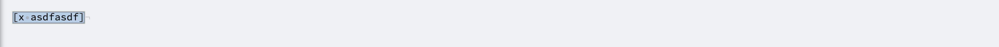
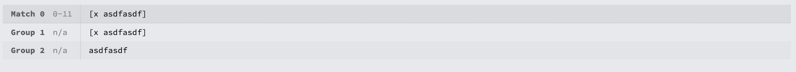
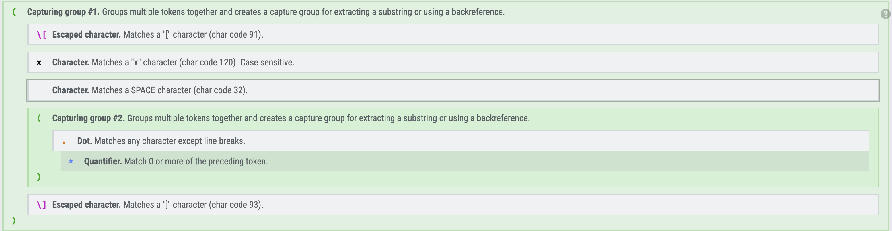
as shown in the images above the pattern matches `[` and everything `(.*)` after it then matches `]` 
the first and second `()` splits what's matched into capturing groups in our example `Group1 : [x adfasdf]` and `Group2 : asdfadsf`
so which Group will be replaced ?

**\2 regex** 

if we take a closer look at the parameter of the function `"y(\"\\2\")"` `\2` is used for backreferencing. This means it refers to the content matched by the second capturing group in the regular expression in our case the **replacement** of `[x some_text] ` is `some_text`

**/e modifer**

`/e` makes the replacement `[x some_text]` in our case `y(some_text)` executed as php code.


Our goal is to make the program execute the `getflag` command but the problem is that `/e` only execute php code .


**How can we make `getflag` execute like php code ?**

Reading through this article about  [Exploiting PHP PCRE Functions](https://www.madirish.net/402) we found interesting facts about the **backtick operators**

>Using the backtick operators is the perfect solution. It turns out that PCRE doesn't actually escape these, so you can use backticks with the '/e' flag to cause PHP code to be evaluated. This is particularly dangerous as the third argument in the preg_replace() function is often user supplied data.

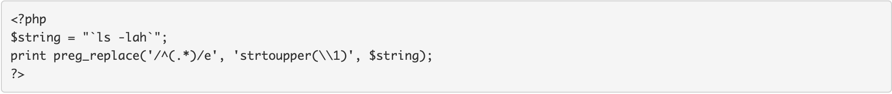

Trying to simulate the same example (removing the double quotes ) results in a success the `id` command gets executed perfectly

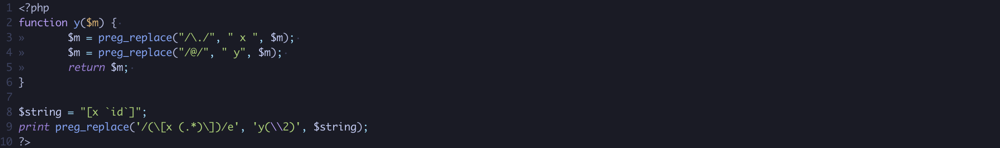
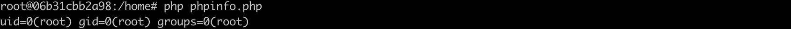

Let's try to add the double quotes around `y()` function argument `y(\"\\2\")`

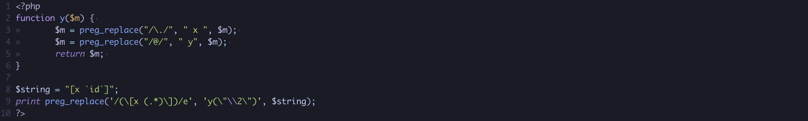
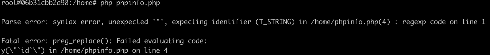


The problem occurs because it tries to execute: y("id") as PHP code.

The solution of this problem is with the `${ expression }` syntax which deprecated as of PHP 8.2.0 ( we're working with PHP 5.3.10)

the difference between `$expression` and `${ expression }` in this example (**$name == "\`id\`"**): 

- `echo "$name";`  // PHP directly substitutes the variable's value
- `echo "${name}";`  // PHP evaluates 'name' as an expression first

## Cracking process

Now let's try to create a file `/tmp/command` that's going to passed as the first argumment of `level06` containing the combination of `${ expression }` and the backtick operators .

The payload works by:

- The regex matches **[x ${\`getflag\`}]**
- The second capture group contains **${\`getflag\`}**
- The replacement becomes **y("${\`getflag\`}")**
- The `/e` modifier evaluates this as PHP code
- PHP evaluates **${\`getflag\`}** as an expression, executing the getflag command
- The command runs with `flag06` privileges due to the setuid bit

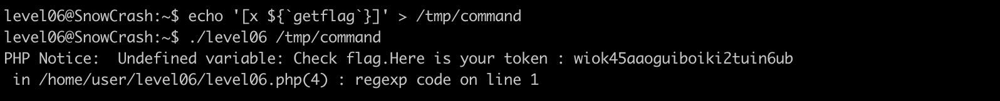

and we got the password for the next level.

## Conclusion

This level demonstrates a classic PHP code injection vulnerability through the dangerous combination of:

- User-controlled input being processed by `preg_replace()`
- The deprecated `/e` modifier enabling code evaluation
- Insufficient input sanitization
