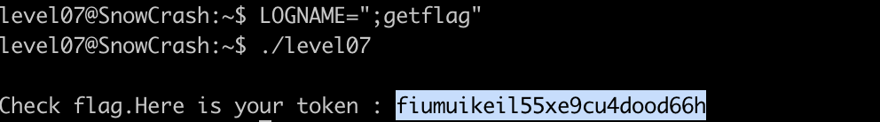

# Level07 Writeup

## Level Overview

**Category :** Binary Exploitation / Environment Variable Injection

**Description :** 
Exploit a setuid binary that uses environment variables in an unsafe `system()` call to achieve privilege escalation and execute commands as the `flag07` user.

## Analysis

Upon Entering this level we find a `32 bit executable` owned by the user `flag07` and has setuid bit set

Executing the binary outputs `level07`

let's try to analyze more the binary and use `ltrace` to display the library calls made by the program

Going through the output of `ltrace` the program  does the following instructions : 

- Gets the effective UID of calling process
- Sets the real UID to the effective UID using `setresgid()` and `setresuid()`
- Gets the value of `LOGNAME` environment variable with `getenv("LOGNAME")`
- Prints `level07` with `system("/bin/echo level07")`

Changin the value of `LOGNAME` reflects on the output meaning the program prints the value of `LOGNAME`

The vulnerability appears in `getenv()` function we can inject some code in `LOGNAME`  environment variable and it expandes inside the system parameter and gets excuted.

Reading through `getenv`'s [manpage](https://man7.org/linux/man-pages/man3/getenv.3.html) we can confirm the vulnerabilty

>The GNU-specific secure_getenv() function is just like getenv() except that it returns NULL in cases where "secure execution" is required.

>Secure execution in Linux binaries refers to measures and practices aimed at preventing unauthorized access, modification, or exploitation of executable files and their execution environment.

However, this binary uses `getenv()` (not `secure_getenv()`), meaning it will read environment variables even in setuid context, making it vulnerable to environment variable injection.

## Cracking process

The Process of exploiting this program is to inject `LOGNAME` with `;getflag`

The `echo` function will try to print any thing before the `;` and getflag will executed  `system(/bin/echo ; getflag)`

and voila `getflag` got executed and we got the password for the next level

## Conclusion

This level demonstrates a classic environment variable injection vulnerability in setuid binaries. The vulnerability occurs because:

- Unsafe Environment Variable Usage: The program uses `getenv()` instead of `secure_getenv()`, allowing environment variable access in setuid context
- Command Injection: User-controlled environment variables are incorporated into `system()` calls without sanitization
- Privilege Context: The setuid bit allows the injected commands to execute with elevated privileges