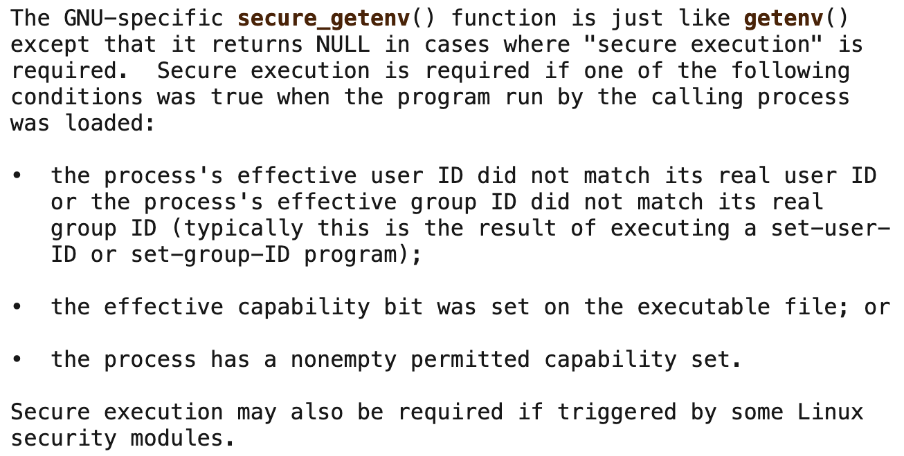

# Level07

When this level we find a `32 bit executable` owned by the user `flag07` and has setuid bit set

**objective**
exploit the executable to run commands as `flag07`

**analysis**

executing the binary it outputs the name of the level

let's try to analyze more the binary and use `ltrace` to display the library calls made by the program

well the binary made multiple functions calls : 

1. `getegid()` 
2. `geteuid()`
3. `setresgid()`
4. `setresuid()`
5. `getenv()`
6. `system()`

first idea try to exploit the `LOGNAME`  variable env inject some code in the variable and it expandes inside the system parameter it gets excuted.

but first let's first read about the `getenv`

some interesting stuff about the function `getenv` when reading the manpage [manpage](https://man7.org/linux/man-pages/man3/getenv.3.html)

which means  whether "secure execution" (Secure execution in Linux binaries refers to measures and practices aimed at preventing unauthorized access, modification, or exploitation of executable files and their execution environment.) is required or not `getenv` will not return NULL it will return whatever you pass to it

 **Cracking process**

Our first idea was right let's try to inject `getflag` in `LOGNAME`
we can use `;` or `&&` to make `system` function treats `getflag` as the second command

and voila `getflag` got executed and we got the password for the next level : fiumuikeil55xe9cu4dood66h

**Conclusion**

use `secure_getenv()` to avoid vulnerabilities that could occur if set-user-ID or set-group-ID programs accidentally trusted the environment.