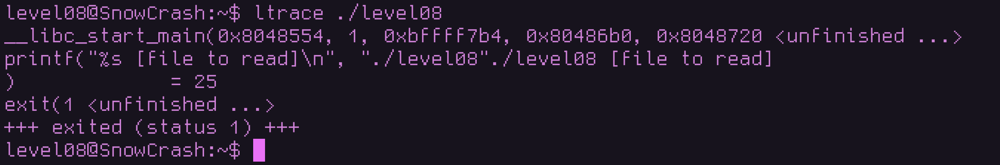
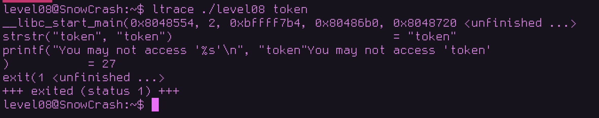
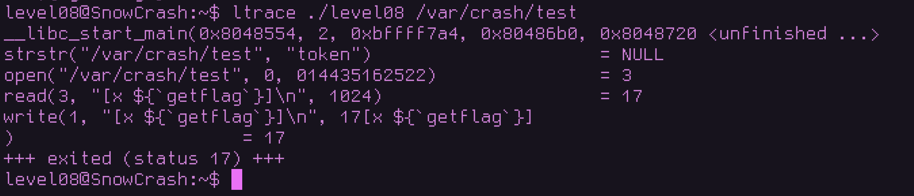

# **Objective**  
This challenge requires reading the flag using a specific binary file: `level08`.  
The flag is stored in a file named `token`.  

  

---

# **Initial Recon / Analysis**  
To start, we ran a library call trace on the binary:  

  

From this trace:  
- The binary calls `printf` to display usage: `./level08 [file to read]`  
- It then calls `exit(1)`, meaning no file argument was given, so it quits immediately.  

This tells us the binary accepts arguments. Let’s try running `ltrace` again, this time providing the `token` file as an argument.  

---

## **Testing with the token file**  
  

From the trace, we see that the binary performs a string check:  
`strstr("token", "token")`
After that, it prints:  
`printf("You may not access '%s'\n", "token")`
Output:  
You may not access 'token'

This means the binary explicitly checks for the **name** `token` and blocks it.  

---

## **Testing with a different file**  
  

Here, the binary doesn’t block access because the filename is different from `token`. This confirms the binary’s restriction is purely based on the filename, not the file contents.  

---

## **Exploitation**  
We can bypass this restriction by creating a symbolic link to the `token` file but giving it a different name.  

### **First attempt (failed)**  
```bash
ln -s token /var/crash/bokan
```

This failed because it created a broken link. Relative symbolic links look for the target file relative to the link’s location, so /var/crash/token didn’t exist.

### **Successful attempt**
We need an absolute path:

```bash
ln -s /home/user/level08/token /var/crash/bokan
```
Now /var/crash/bokan points correctly to the token file.

### **Retrieving the flag**
We can now pass the symlink to the binary:

```
./level08 /var/crash/bokan
```


## Key Takeaways

The binary filters access based solely on filename, not contents.

ltrace quickly reveals such checks without deep reverse engineering.

Always remember the difference between relative and absolute symlinks when bypassing filename restrictions.