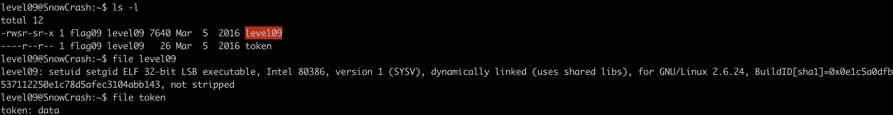
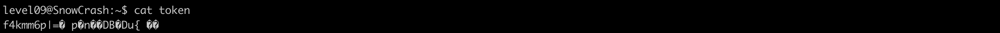
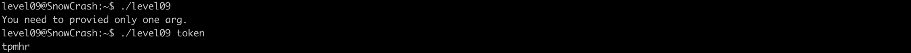
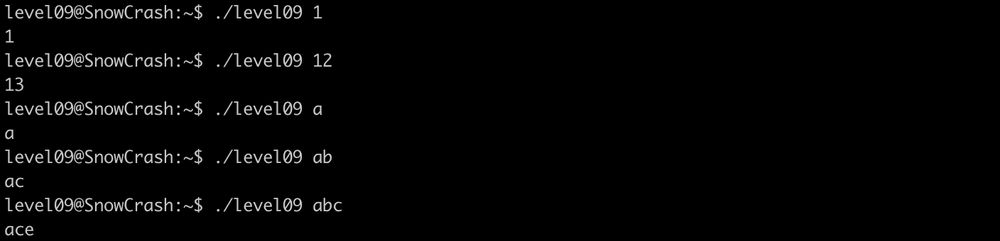
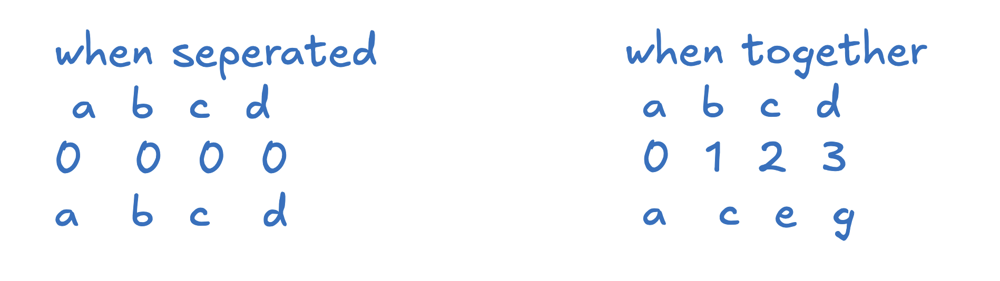
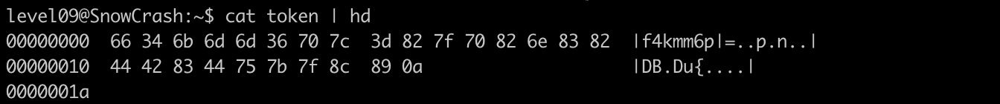
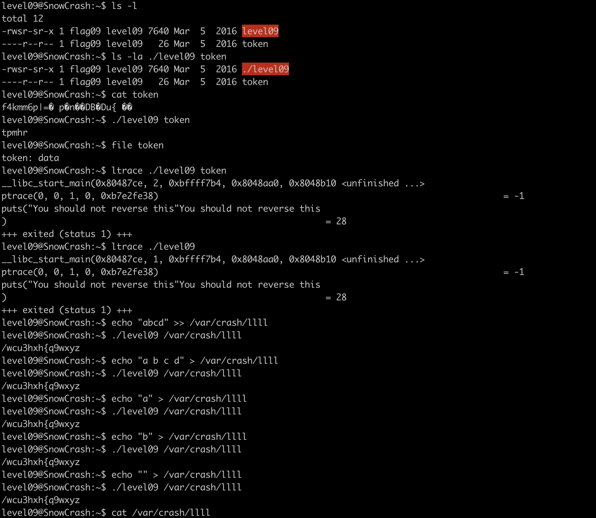
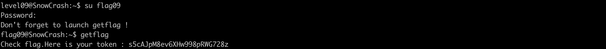

# Level09 Writeup

## Level overview
**Category :** Cryptography / Reverse Engineering

**Description :** Reverse a simple Caesar cipher with incremental shift values to decode an encrypted token and gain access to the flag09 user account.
## Analysis

Entering this level we list files in the directory we found 2 files:
- 32-bit executable owned by `flag09` with setuid bit set
- A regular file containing some data




Outputing the content of the file we can see that it contains displayable/non-displayable characters




executing the program without arguments results in message that we should provide one argument

passing `token` file we get a string `tmphr`




the program doesn't specify that we should pass a file, which means we can try different types of arguments

after some experimentation with the binary we found that the program treats the input as string,  iterates over it and shift each character by a value, the value start with `0` and increment by `1`

hence why the program displayed `tpmhr` when passing `token`



Here is a small illustration of how the program works.




looking back at the content `token` , maybe the its content is the ouput of `level09` with a given string


let's try to reverse the content of `token` to get the initial string


## Cracking process

the first problem that we are going encounter is the non displayable character, which are a result of a character being with a value and the result is invalid UTF-8 sequences , which means we can't reshift using the asccii character we need a more consistent data representation like binary or hexadecimal for a more abstract way to represent binary


to represent the content of `token` in hexadecimal we are going to use the `hd` command or `hexdump -C` which displays the output in hex and its ascii representation




looking through the output we can see bytes seperated with space and  represented in hex along side an ascii representation.

we're going to store all these bytes in a string exept from the `0a` which represents newline reverse shift using a python script


<!--  -->
```python
hex_string = "66 34 6b 6d 6d 36 70 7c 3d 82 7f 70 82 6e 83 82 44 42 83 44 75 7b 7f 8c 89" # string containing hex bytes 

hex_bytes = hex_string.split(" ") # split the hex_string by space

shift = 0;
for byte in hex_bytes:
    decimal = int(byte, 16) - shift # converting hex byte to its decimal form and subsctract shift from it
    character = chr(decimal) # converting the decimal form to ascii representaion
    print(character, end="")
    shift += 1
```
running the script we get a proper string : `f3iji1ju5yuevaus41q1afiuq`

we switch to the user `flag09` run `getflag` command and we get the password for the next level



## Conclusion

This level demonstrates a fundamental cryptanalysis challenge where we successfully reversed a simple incremental Caesar cipher. The vulnerability lay in the predictable encryption pattern - each character shifted by its position value, making decryption straightforward once the algorithm was identified.