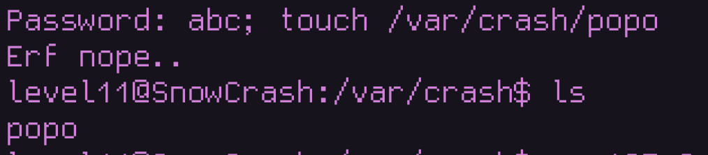
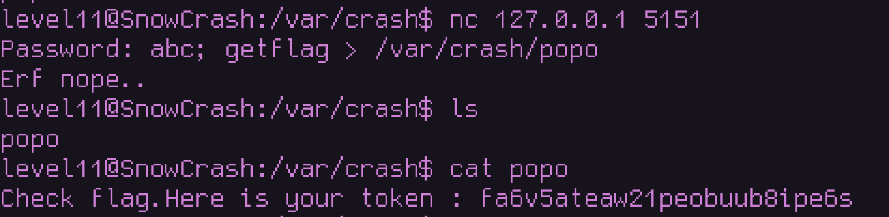

# 📜 Level11 Writeup

## Level Overview

Category: Remote Exploitation / Command Injection

Description:
We are given a Lua socket server running on 127.0.0.1:5151. The server accepts a password and compares its SHA1 hash to a hardcoded value. If the hash matches, the user “wins.” However, the hashing function uses insecure shell execution, which opens the door to command injection and allows arbitrary command execution on the box.

The whole script is pointless and does not have a point except bein exploited
cause even if you got the hash cracked. the password will not work either way and even if it did it wil only print a dump message

```lua
#!/usr/bin/env lua
local socket = require("socket")
local server = assert(socket.bind("127.0.0.1", 5151))

function hash(pass)
  prog = io.popen("echo "..pass.." | sha1sum", "r")
  data = prog:read("*all")
  prog:close()

  data = string.sub(data, 1, 40)

  return data
end


while 1 do
  local client = server:accept()
  client:send("Password: ")
  client:settimeout(60)
  local l, err = client:receive()
  if not err then
      print("trying " .. l)
      local h = hash(l)

      if h ~= "f05d1d066fb246efe0c6f7d095f909a7a0cf34a0" then
          client:send("Erf nope..\n");
      else
          client:send("Gz you dumb*\n")
      end

  end

  client:close()
end
```

## Observations

* The server is written in Lua and listens on port 5151.
* It asks for a password over a TCP connection.
* The password is hashed via sha1sum using io.popen:

```lua
prog = io.popen("echo "..pass.." | sha1sum", "r")
```

* This concatenates user input directly into a shell command.

Running the server and connecting via netcat:

```lua
$ nc 127.0.0.1 5151
Password: test123
Erf nope..
```

Clearly, the password check fails.

## Identifying the Vulnerability

The issue lies in unsanitized input passed into the shell.

The command looks like:

```bash
echo <input> | sha1sum
```

If we inject ; or &&, we can chain additional commands.

```bash
Password: abc; ls
```

Which executes:

```bash
echo abc; ls | sha1sum
```

Confirming command injection.



## Exploit Strategy

The strategy is simple:

1.Connect to the server

2.Inject a command after the password input.

3.run the getflag command as flag11 and past it in a file

## Exploitation


