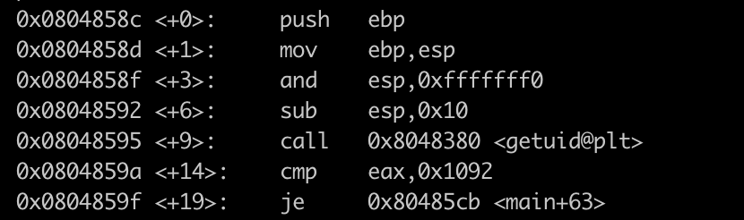
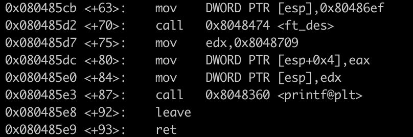
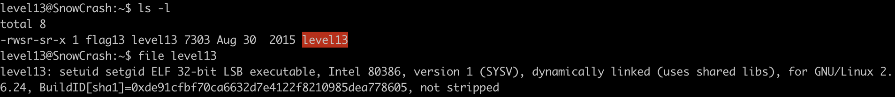

# Level 13 Writeup

## Level Overview

**Category:** Reverse Engineering / Binary Exploitation

**Description:**
This level presents a 32-bit executable with setuid privileges that performs a user ID verification before revealing a token. The program checks if the current user's UID matches a specific value (4242) and only displays the flag if the condition is met. Since we cannot legitimately change our UID, this challenge requires reverse engineering the binary to understand its control flow and using debugging techniques to manipulate program execution at runtime
## Analysis

Entering this level we find a **32-bit executable with setuid and setgid bit set** owned by **flag13**

Executing the program result in a message `UID 2013 started us but we expect 4242`

which means the program has to be run by a user with **UID 4242**

when tracing the library calls by the program we found 2 functions calls :

- getuid() that gets the real UID of the calling process
- printf() which prints the message

The program checks our real UID and prints a message depending on it

Let's try to change our UID by creating a new user with UID 4242 using **useradd** command : 

As expected we can't create a new user because we don't have sudo privileges

we need to understand more about the what the program is doing **ltrace** and **strace** are not giving us much, so we are going to use **gdb  which is going to allow us to see what is going on ''inside'' the program while it executes**

We run **gdb ./level13** , set the disassembly flavor to intel for a more readable syntax and disassemble the main function to show all the assembler instructions from the main function. 

It looks complicated but we can ignore most of the instructions we will focus on the following instructions `call, cmp, je`

- `call 0x8048380 <getuid@plt>` the function gets th real UID of the calling process

- `cmp eax, 0x1092` compares the value inside the `eax` register and the **(0x1092)16 == (4242) if they are equal zero `zf` bit is set to 1
10** 
-  `je 0x80485cb <main+63>` **jump** to the address `0x80485cb` if `zf` is **equal** to 1

**First branch :**

- `call 0x80483880`get the real UID of the calling process
- `call 0x8048360` print to STDOUT `UID 2013 started us but we expect 4242`
- `call 0x80483a0` exit with 1

**Second branch :**

- `call   0x8048474 <ft_des>` ft_des function is called
- `call   0x8048360 <printf@plt>` printf functionis called

Looking at the disassembly, the binary compares the result of getuid() (stored in eax) with 4242.

In our case, since our `UID (2013) ≠ 4242`, the comparison `cmp eax, 0x1092` results in a non-zero value, setting the zero flag `(ZF)` to 0. The subsequent `je` (jump if equal/zero flag set) instruction will NOT jump to the success branch.

This is the key check we need to bypass.

## Cracking process

>Normally when we run a suid/sgid binary under gdb, the elevated privileges are ignored for security reasons - the program runs with your normal user privileges instead of the file owner's privileges. This means we can't access protected resources that require the elevated permissions, but we can still manipulate the program's execution (like changing register values) to observe different code paths.

Thus we will change the return value of `getuid()` stored in the **eax**  register

Since `cmp eax, 0x1092` checks if UID == 4242, forcing eax=4242 ensures the conditional jump goes to the second branch.

and we got the password for the next level

## Conclusion
This level demonstrated bypassing a UID check through dynamic analysis. By using GDB to manipulate the eax register value during the getuid() comparison, we forced the program to execute the success branch and retrieve the token