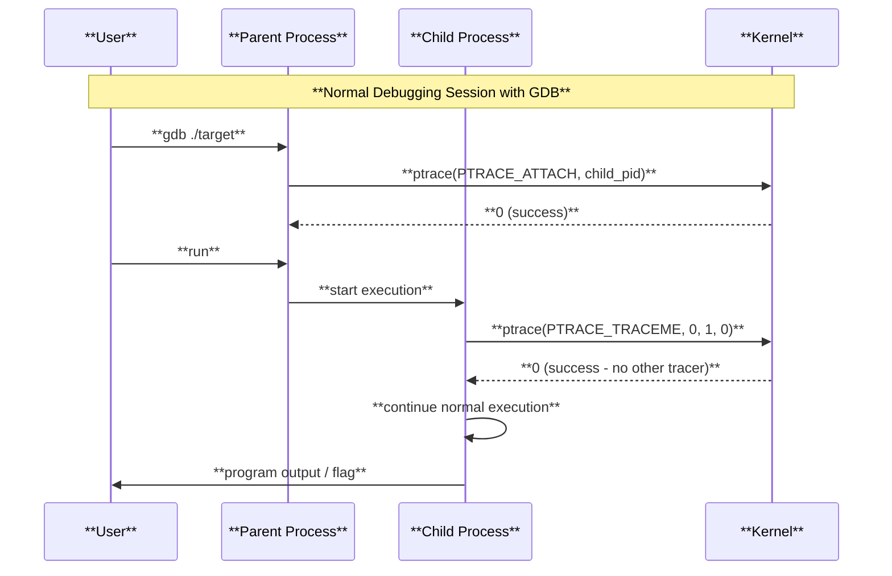
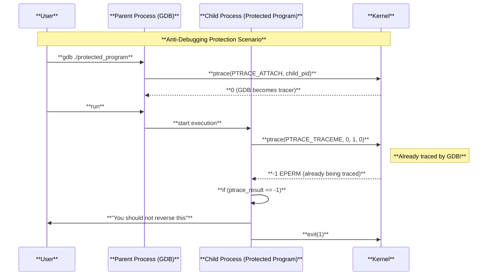
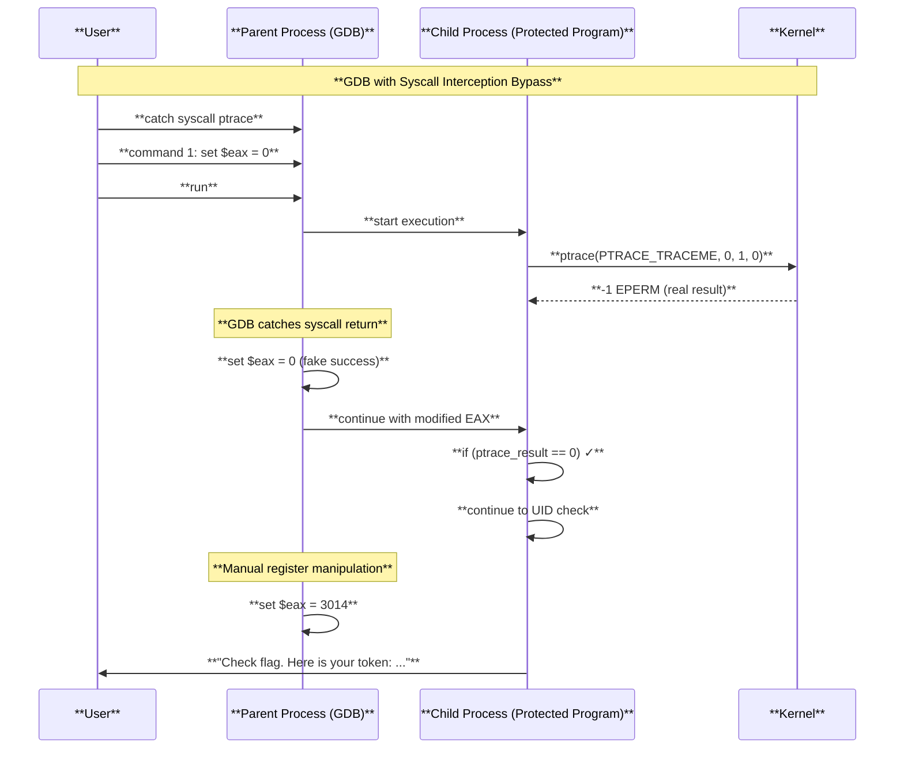

# 📜 Level14 Writeup
## Level Overview
**Category**: Binary Exploitation / Anti-Debugging Bypass
**Description**:
We are given the binary `getflag` on the SnowCrash VM. The binary protects itself against debugging by using the `ptrace` system call. When executed under a debugger, `ptrace(PTRACE_TRACEME, ...) `fails (returns `-1` / `EPERM`) and the program exits with a warning:
```
You should not reverse this
```
The challenge: we need to bypass the anti-debugging check to get the flag.

## Understanding Ptrace: The Complete Picture

### What is Ptrace?
The `ptrace` (process trace) system call is a powerful Linux/Unix mechanism that allows one process to observe and control the execution of another process. It's the foundation for debuggers like GDB, strace, and system monitoring tools.

### Ptrace Function Signature
```c
#include <sys/ptrace.h>

long ptrace(enum __ptrace_request request, pid_t pid, void *addr, void *data);
```

### Parameters Explained
1. **request**: The operation to perform (see below for full list)
2. **pid**: Process ID of the target process (0 for self when using PTRACE_TRACEME)
3. **addr**: Address in the target process's memory space
4. **data**: Data to write or buffer for read operations

### Ptrace Request Types

#### Process Control Requests
- **PTRACE_TRACEME**: Current process becomes traceable by its parent
- **PTRACE_ATTACH**: Attach to another process for tracing
- **PTRACE_DETACH**: Detach from traced process
- **PTRACE_KILL**: Terminate the traced process

#### Execution Control Requests
- **PTRACE_CONT**: Continue execution of traced process
- **PTRACE_SINGLESTEP**: Execute one instruction, then stop
- **PTRACE_SYSCALL**: Continue until next system call entry/exit

#### Memory Access Requests
- **PTRACE_PEEKTEXT**: Read word from process text segment
- **PTRACE_PEEKDATA**: Read word from process data segment
- **PTRACE_PEEKUSER**: Read word from process user area (registers, etc.)
- **PTRACE_POKETEXT**: Write word to process text segment
- **PTRACE_POKEDATA**: Write word to process data segment
- **PTRACE_POKEUSER**: Write word to process user area

#### Register Access Requests
- **PTRACE_GETREGS**: Get all general-purpose registers
- **PTRACE_SETREGS**: Set all general-purpose registers
- **PTRACE_GETFPREGS**: Get floating-point registers
- **PTRACE_SETFPREGS**: Set floating-point registers

### Anti-Debugging with PTRACE_TRACEME

#### How PTRACE_TRACEME Works for Anti-Debugging
```c
// Typical anti-debugging check
if (ptrace(PTRACE_TRACEME, 0, 1, 0) == -1) {
    printf("Debugger detected!\n");
    exit(1);
}
```

**Key Principle**: A process can only be traced by one tracer at a time. When a debugger like GDB attaches to a process, it becomes the tracer. If the process then calls `ptrace(PTRACE_TRACEME, ...)`, the call fails because the process is already being traced.

#### Return Values and Error Codes
- **Success**: Returns 0 for PTRACE_TRACEME
- **Failure**: Returns -1 and sets errno
  - `EPERM`: Operation not permitted (already being traced)
  - `ESRCH`: No such process
  - `EINVAL`: Invalid request
  - `EIO`: Input/output error

### Ptrace Examples

#### Example 1: Basic Process Tracing
```c
#include <sys/ptrace.h>
#include <sys/wait.h>
#include <unistd.h>
#include <stdio.h>

int main() {
    pid_t child = fork();
    
    if (child == 0) {
        // Child process - make it traceable
        ptrace(PTRACE_TRACEME, 0, NULL, NULL);
        execl("/bin/ls", "ls", NULL);
    } else {
        // Parent process - trace the child
        int status;
        wait(&status);  // Wait for child to stop
        
        // Continue child execution
        ptrace(PTRACE_CONT, child, NULL, NULL);
        wait(&status);
    }
    return 0;
}
```

### Advanced Anti-Debugging Techniques

#### Multiple Ptrace Checks
```c
// Check 1: Initial PTRACE_TRACEME
if (ptrace(PTRACE_TRACEME, 0, 1, 0) == -1) exit(1);

// Check 2: Verify we can still trace ourselves
if (ptrace(PTRACE_TRACEME, 0, 1, 0) != -1) exit(1);  // Should fail now

// Check 3: Try to trace parent process
if (ptrace(PTRACE_ATTACH, getppid(), 0, 0) == 0) exit(1);
```

## Analysis







## Observing System Calls
Running `strace` reveals the anti-debugging check:
```
level14@SnowCrash:~$ strace getflag
...
ptrace(PTRACE_TRACEME, 0, 0x1, 0) = -1 EPERM (Operation not permitted)
write(1, "You should not reverse this\n", 28) = 28
exit_group(1)
```
The key line is:
```
ptrace(PTRACE_TRACEME, 0, 0x1, 0) = -1 EPERM
```
This means the binary detects that it is being debugged and exits immediately.

**Parameters Analysis**:
- `PTRACE_TRACEME`: Request to make current process traceable
- `0`: pid parameter (ignored for PTRACE_TRACEME)
- `0x1`: addr parameter (usually ignored for PTRACE_TRACEME)
- `0`: data parameter (unused)
- Return: `-1` with `EPERM` indicating the process is already being traced

## Disassembly Analysis
```
(gdb) disassemble main
...
0x08048982 <+60>:    call   0x8048540 <ptrace@plt>
0x0804898e <+72>:    test   %eax,%eax
0x08048990 <+74>:    jns    0x80489a8 <main+98>
0x08048992 <+76>:    movl   $0x8048fa8,(%esp)
0x08048999 <+83>:    call   0x80484e0 <puts@plt>
0x0804899e <+88>:    mov    $0x1,%eax
0x080489a3 <+93>:    jmp    0x8048eb2 <main+1388>
...
```
Key points:
* `call ptrace` → result stored in `EAX`.
* `test eax,eax` / `jns` → program checks if `ptrace` succeeded.
* If failed `(EAX < 0)`, prints the anti-debug message and exits.

## Exploitation in GDB
We can bypass the anti-debugging by modifying the return value of ptrace so the program believes it succeeded:
```
gdb getflag
(gdb) catch syscall ptrace
Catchpoint 1 (syscall 'ptrace' [26])
(gdb) command 1
Type commands for breakpoint(s) 1, one per line.
End with a line saying just "end".
>set $eax = 0
>print $eax
>continue
>end
(gdb) b main
Breakpoint 2 at 0x804894a
(gdb) run
```
Explanation:
1. `catch syscall ptrace` → stop when the binary calls `ptrace`.
2. `command 1` → automatically run commands when the catchpoint triggers:
    * `set $eax = 0` → fake the return value of `ptrace` to indicate success.
    * `continue` → resume execution.
3. Break at `main` for further inspection

### Why This Works
When GDB catches the ptrace syscall, it stops execution right after the system call returns. At this point:
1. The real ptrace call has already failed (returned -1)
2. We manually set EAX to 0, simulating success
3. The program's conditional check now sees 0 instead of -1
4. Execution continues past the anti-debugging check

## Adjusting the UID Check
After bypassing the `ptrace` check, the binary checks some internal value (like UID) before giving the flag. We set it manually:
```
---Type <return> to continue, or q <return> to quit---q
(gdb) break *0x08048b0a
Breakpoint 3 at 0x8048b0a
(gdb) run
Starting program: /bin/getflag
Breakpoint 2, 0x0804894a in main ()
(gdb) continue
Catchpoint 1 (call to syscall ptrace), 0xb7fdd428 in __kernel_vsyscall ()
$1 = 0
Catchpoint 1 (returned from syscall ptrace), 0xb7fdd428 in __kernel_vsyscall ()
$2 = 0
Breakpoint 3, 0x08048b0a in main ()
(gdb) set $eax = 3014
(gdb) c
Continuing.
Check flag. Here is your token: 7QiHafiNa3HVozsaXkawuYrTstxbpABHD8CPnHJ
[Inferior 1 (process 2953) exited normally]
```
* `$eax = 3014` → manually sets the value to satisfy the binary's internal check.
* Program continues and prints the flag.

## Conclusion
`getflag` uses `ptrace(PTRACE_TRACEME)` to detect debuggers. By:
1. Catching the `ptrace` syscall in GDB.
2. Setting its return value to `0` (pretending the call succeeded).
3. Adjusting `$eax` for the internal UID/validation check.
We bypassed the anti-debug mechanism and retrieved the flag.

The ptrace system call is a powerful tool for both legitimate debugging and anti-debugging protection. Understanding its parameters, behavior, and limitations is crucial for reverse engineering and security analysis.

```
7QiHafiNa3HVozsaXkawuYrTstxbpABHD8CPnHJ
```
